# Docker

## Why docker?

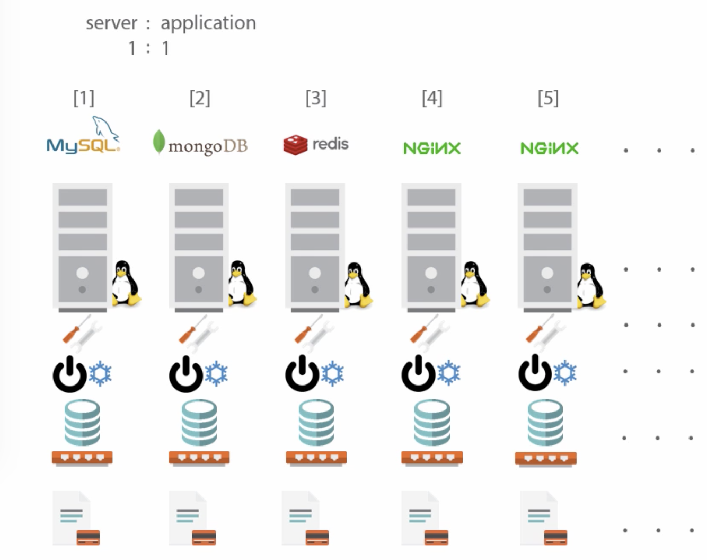

* Bare-metal hosting has a 1:1 relationship between server and application
* Requires lots of infrastructure and management
* Waste of resources because server resources are used little, high TCO
* It's hard to move apps to other servers

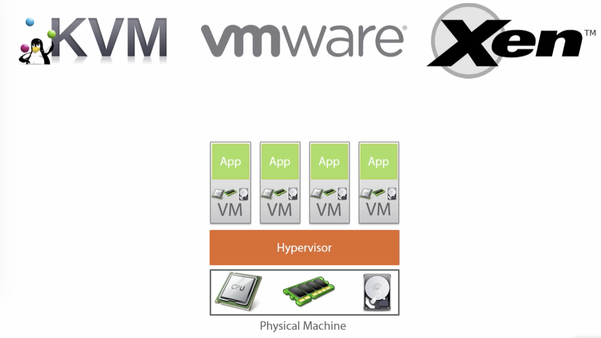

* Virtual Machines share hardware through Hypervisor, but not OSes
* VMs require OS licensing and management
* 1 app per Virtual Machine
* Led to higher resource utilization, but still with overhead
* Hard to scale applications to other servers

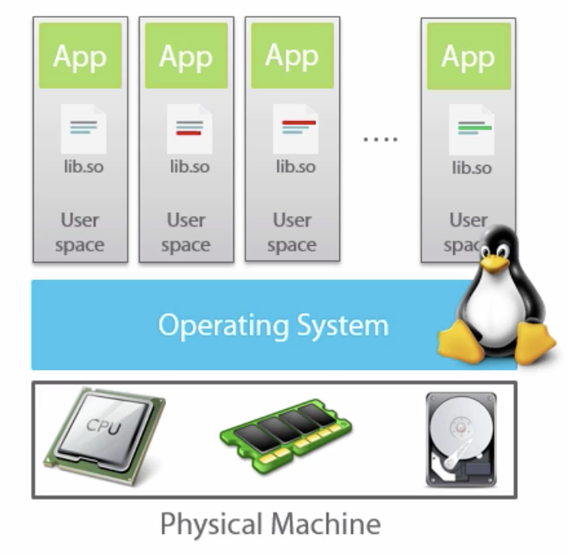

* Docker by default only shares the kernel with the host OS
* 1 app per container
* Docker is very lightweight, runs on Linux and Windows 10 or Server 2016 hosts
* Docker abstracts the file system and network from the container
* Containers share CPU, RAM, storage, network
* Isolation is done by several Linux Kernel User Spaces

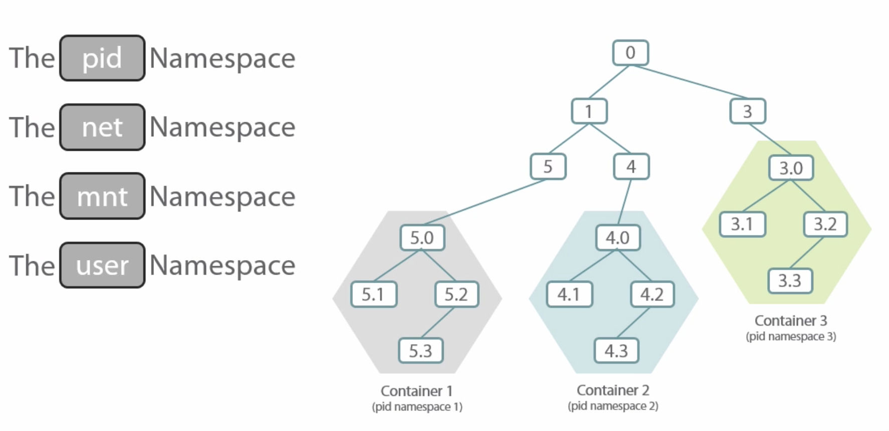
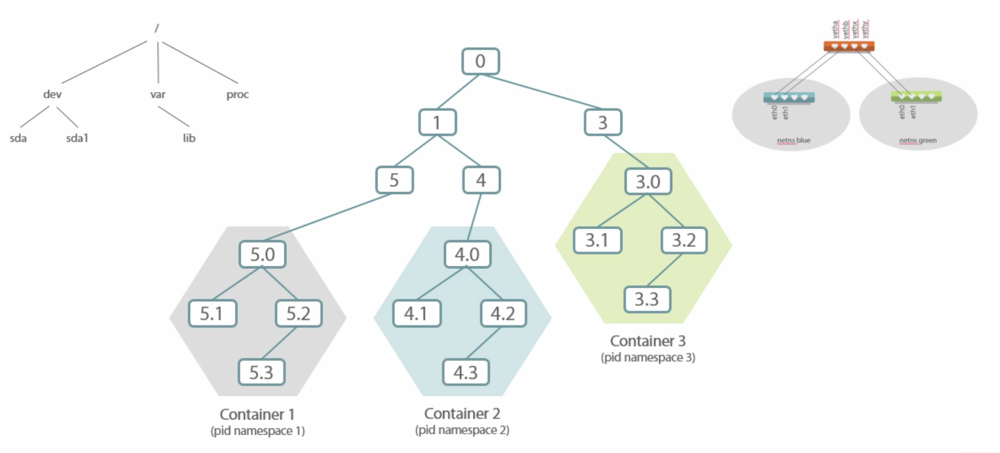
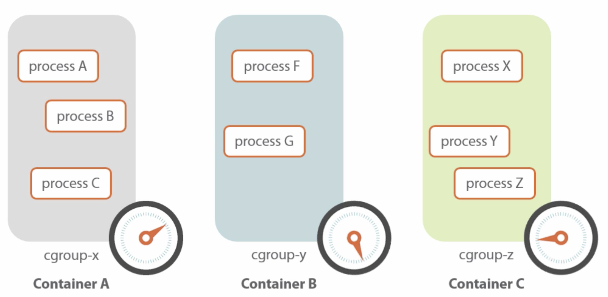

## Docker components

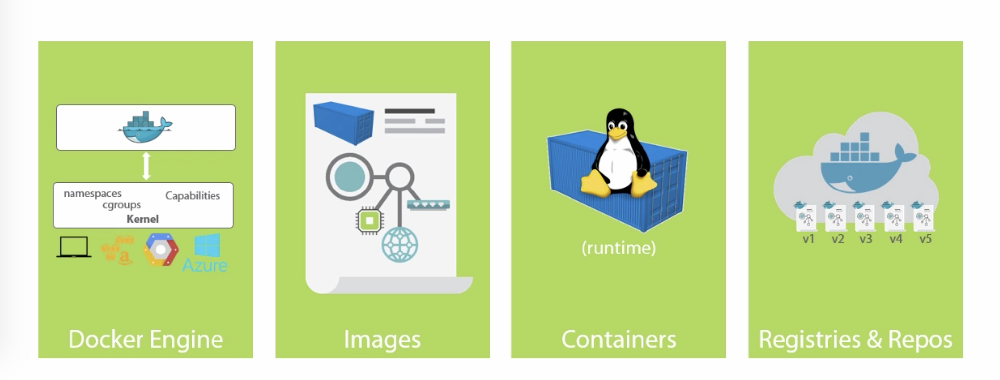

* Docker Engine runs containers
  * Listens to local UNIX socket by default (`/var/run/docker.sock`)
* We interact with the Docker Client which talks to a local or remote Docker
  Engine
  * `export DOCKER_HOST=...` to talk to remote engine listening on TCP port
  * Add users to `docker` group to allow non-root users access to the docker
    UNIX socket
  * The client provides entrypoints to the engine's features, e.g. for image
    handling through `docker image <command>` and container handling through
    `docker container <command>`. There are legacy commands that still can be
    used, e. g. `docker pull` == `docker image pull` and `docker run` ==
    `docker container run`.

```sh
$ docker --version
Docker version 26.0.0, build 2ae903e

$ docker info
Client: Docker Engine - Community
 Version:    26.0.0
 Context:    default
 Debug Mode: false
 Plugins:
  buildx: Docker Buildx (Docker Inc.)
    Version:  v0.13.1
    Path:     /usr/libexec/docker/cli-plugins/docker-buildx
  compose: Docker Compose (Docker Inc.)
    Version:  v2.25.0
    Path:     /usr/libexec/docker/cli-plugins/docker-compose

Server:
 Containers: 51
  Running: 49
  Paused: 0
  Stopped: 2
 Images: 49
 Server Version: 26.0.0
 Storage Driver: overlay2
  Backing Filesystem: xfs...
```

Commands shown:

```sh
docker run <image>
docker run -it <image> <command>
docker run -d <image> <command>
docker attach
# Ctrl+P,Q to detach
docker stop <container>
docker kill <container>
docker images
docker ps -a
docker pull <image>
docker pull <image:tag>
```

## Images and containers

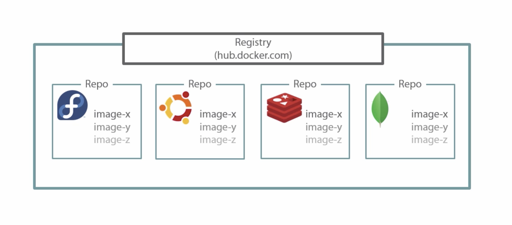

* Images are sharable blueprints for containers
* Images provide the root file system for containers
* Containers are created from images
* Images can be thought of as stopped containers
* An image can be addressed by `ID` (e.g. `15895ef0b3b2`) or `name:tag`
  (e.g. `fedora:latest`)
* Containers share images, e.g. if you create 2 containers from 1 image, the
  image will be reused and not downloaded again
* Images are composed of read-only layers
* File modifications made by the container cause changes in the writeable layer
  for that specific container (~ Copy-on-write file system)
* This provides isolation per container
* Immutability is king (almost anywhere in docker)
* Images can be created on one machine and run on another machine, e.g.
  1. Create images in CI
  1. `docker push` to internal image registry
  1. Deploy to production servers using `docker pull`/`docker run`

## Images

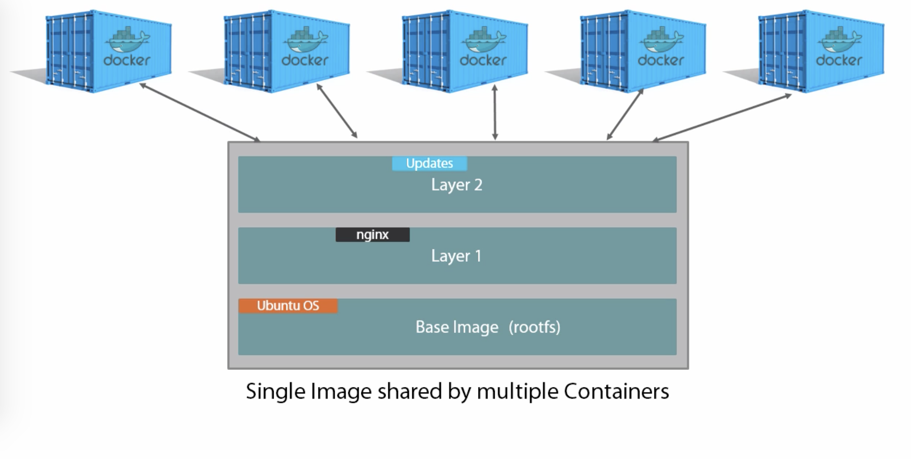

* Definition construct
* Read-only
* Mostly bare-bones (depends on image, OS images don't have all usual commands
  installed like `ping`)
* Special container Linux images, e.g. Alpine Linux which is just 5 MB or
  single-binary [Go](https://go.dev/) images
* Comprised of layers
* Downloaded from a registry, e.g. [hub.docker.com](https://hub.docker.com)
* Stored locally in `/var/lib/docker` (depending on storage driver)
* Tags are used to specify other versions than `latest`

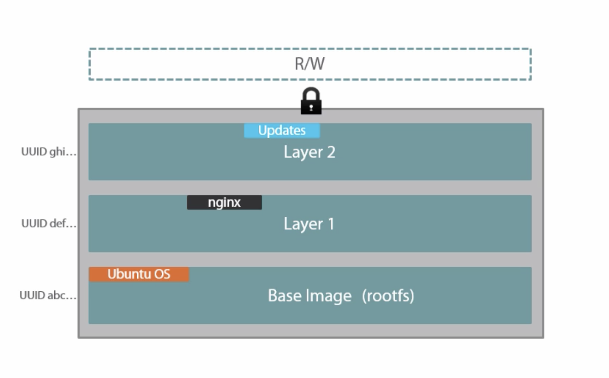
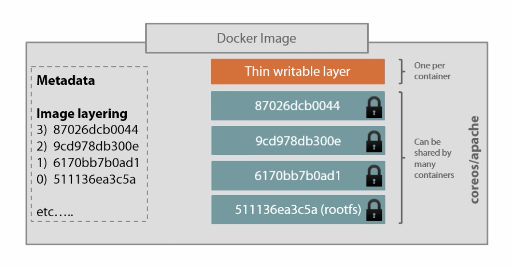

* Layers are union-mounted into a single file system
  * Higher layers win over lower layers
  * Combined read-only, single view
  * [Different drivers available](https://docs.docker.com/engine/userguide/storagedriver/selectadriver/) (`aufs`, `devicemapper`, ...)

Commands shown:

```sh
docker pull <image>
docker pull -a <image>
docker images
docker history <image>
docker rmi <image>
```

### Exercise 1 - Hello world

1. Run the `hello-world` image in a new container
1. Remove the container
1. Remove the image
1. Also try it the other way around!

## Containers

* Runtime construct
* Get an auto-generated name assigned unless `docker run --name <name>`
* File system modifications happen in the container-specific writable layer
* Root process gets PID 1, container exits when PID 1 exits
  * Further control with `docker stop` (sends `SIGTERM` to PID 1), `docker kill`
    (sends `SIGKILL` to PID 1) and `docker restart`
* Have an isolated:
  * process tree,
  * network stack (routing table, ports),
  * mounts,
  * users (e.g. root inside the container, but not outside),

  which are realized using Kernel Namespaces
* Kernel `cgroup`s are used to limit resource usage (CPU, network, etc.)
* Kernel capabilities can be used to give a container more or less permissions,
  e.g. bind to low-numbered port
* PID 1 is most often *not* `init`, so child processes are not terminated
  gracefully
* You need to cater for PID 1 processes that start other processes

Commands shown:

```sh
docker run --name <name> <image> <command>
docker run -it <image> <command>
docker run -d <image> <command>
docker run --rm <image>
docker exec -it <container> <command>
docker top <container>
docker attach <container>

docker start <container>
docker stop <container>
docker restart <container>

docker ps
docker ps -a
docker rm <container>

docker create --name <container> <image>
docker tag <image> <tag>
docker inspect <container>
docker port <container>
docker logs [-f] <container>

docker commit <container> <image>[:<tag>]
docker save -o <file> <image>
tar -tf <file>
docker rmi <image>
docker load -i <file>

docker run -p <public port>:<internal port> <image>
docker run -v <local path>:<container path> <image>
```

### Exercise 2 - Run `ping` in the background

1. Pull the `alpine` image
1. List all images
1. Run the `alpine` image with `ping 8.8.8.8` command
1. List running containers
1. Show/follow the output from the running `ping`
1. Stop container
1. Start container
1. Step into the container, list all processes

### Exercise 3 - Create a new image manually

1. Start an `ubuntu` container and step into it
1. Install `curl` and exit
1. List all containers
1. Commit the changed container creating a new image
1. List all images
1. Name the new image `curl_example:1.0`
1. Run the new image with `curl https://www.google.com`

## Creating images using Dockerfile

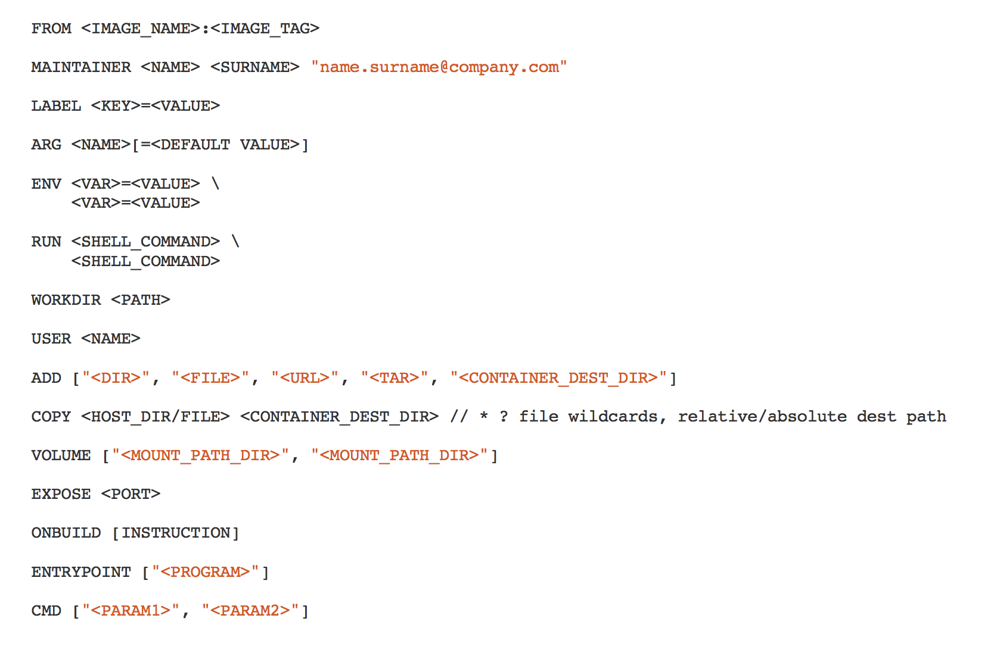

* Plain-text file named `Dockerfile` (casing matters!)
* Defines how to build an image
* Requires `FROM <base image>[:<tag>]` (which can be `scratch`)
* Allows to specify e.g.:
  * Define metadata using labels (`LABEL maintainer "<name and email>"`)
  * Files to be copied to the image: `COPY`, `ADD`
  * Additional packages to be installed: `RUN`
  * Define published ports: `EXPOSE`
  * Automatically-created volumes: `VOLUMES`
  * User running PID 1: `USER`
  * Define environment variables: `ENV`
  * Process running PID 1: `ENTRYPOINT`, `CMD`
  * `# Comments`
* Each line == one image layer (i.e. `docker commit` after each line)
* Build intermediates are cached locally, using checksums for `COPY` and `ADD`,
  `RUN` is cached based on line following `RUN`
* Build can be parameterized using build context directory and `BUILD_ARG`s
* To reduce the size of the build context, use `.dockerignore` files

### `ENTRYPOINT` statement

* Allows you to specify default arguments unless some are provided on the
  command line with `docker run <image> <args>`
* [Example Dockerfile](https://github.com/agross/docker-teamcity/blob/master/Dockerfile#L5-L6) and [`ENTRYPOINT` script](https://github.com/agross/docker-teamcity/blob/master/docker-entrypoint.sh)
* Here `./docker-entrypoint.sh teamcity-server run` is the default
* But you may also run `docker run -it agross/teamcity bash`

### Best practices

1. Containers should be ephemeral
1. Use a [`.dockerignore` file](https://docs.docker.com/engine/reference/builder/#dockerignore-file)
1. Use small base images (e.g. Alpine)
1. Reuse base images across your organization
1. Use tagged base images
1. Use tagged app images
1. Group common operations into a single layer
1. Avoid installing unnecessary packages or keeping temporary files
1. Clean up after yourself in the same `RUN` statement
1. Run only one process per container (try to avoid `supervisord` and the like)
1. Minimize the number of layers
1. Sort multi-line arguments and indent 4 spaces:

   ```dockerfile
   RUN apt-get update && apt-get install --yes \
       cvs \
       git \
       mercurial \
       subversion
   ```

1. `FROM`: Use current official repositories
1. `RUN`: Split long or complex `RUN` statements across multiple lines separated

   ```dockerfile
   RUN command-1 && \
       command-2 && \
       command-3
   ```

1. Avoid distribution updates à la `RUN apt-get upgrade`
1. Use the JSON array format for `CMD` to prevent an additional shell as PID 1

   ```dockerfile
   CMD ["executable", "param1", "param2", "..."]
   CMD ["apache2", "-DFOREGROUND"]
   CMD ["perl", "-de0"]
   CMD ["python"]
   CMD ["php", "-a"]
   ```

1. Use `ENTRYPOINT` only when required
1. `EXPOSE` the usual ports for your applications
1. Prefer `COPY` over `ADD`
1. Leverage the build cache, disable if necessary:
   `docker build --no-cache=true -t <image>[:<tag>] .`

   ```dockerfile
   # Will use cache unless requirements.txt change.
   COPY requirements.txt /tmp/
   RUN pip install --requirement /tmp/requirements.txt
   # Will use cache unless any file changes.
   COPY . /tmp/
   ```

1. Do not use `ADD` to download files, although it's possible. Use `RUN` with
   `curl`, `unzip/...` and `rm` instead to keep images small:

   ```dockerfile
   # Bad - 3 layers.
   ADD http://example.com/big.tar.xz /usr/src/things/
   RUN tar -xJf /usr/src/things/big.tar.xz -C /usr/src/things
   RUN make -C /usr/src/things all

   # Good - 1 layer.
   RUN mkdir -p /usr/src/things \
       && curl -SL http://example.com/big.tar.xz \
         | tar -xJC /usr/src/things \
       && make -C /usr/src/things all
   ```

1. Use [`gosu`](https://github.com/tianon/gosu) when required to run as non-root
1. Have integration tests
1. Develop the `Dockerfile` in a running container, REPL-style
1. Include a `HEALTHCHECK` in the Dockerfile or run containers with
   `--health-{cmd,interval,timeout,retries}`
1. Define directories that will contain persistent data with `VOLUME`s
1. Use multi-stage builds if you have SDK requirements for the build that you do
   not need for production

Commands shown:

```sh
docker build .
docker build --tag <image>:<tag> .
docker build --build-arg <arg>=<value>
docker run --env <var>=<value>
docker run -p <external port>:<internal port> <image>
docker run -p <external port>:<internal port>/udp <image>
docker run -p <ip address>:<external port>:<internal port> <image>
docker run -P <image>
docker port <container>
```

### Exercise 4 - Create a new image using a Dockerfile

1. Repeat the steps from Exercise 3 above using a Dockerfile

### Exercise 5 - Create an app image using a Dockerfile

1. Create a `Dockerfile` for [https://github.com/agross/docker-hello-app](https://github.com/agross/docker-hello-app)
1. Build docker image
1. Run container from image
1. Open web site at [http://localhost:8080](http://localhost:8080)

### Exercise 6 - Define additional environment variables

1. Stop container from Exercise 5
1. Run container from image, with a custom environment variable `THE_ANSWER=42`
1. Open web site at [http://localhost:8080](http://localhost:8080) and see if
   `THE_ANSWER` is there

### Exercise 7 - Overlay files from the image

1. Stop container from Exercise 5
1. Create a new file `index.jade` in the current directory:

   ```jade
   html
     body Content from the host
   ```

1. Start a new container, but overlay the `/app/views/` directory with the
   directory that contains the `index.jade` file above
1. Refresh browser and check if "Content from the host" is displayed
1. Enter the running container and change the contents of
   `/app/views/index.jade` (e.g. using `echo`)
1. Refresh browser
1. Check the contents of `index.jade` on your host

## Registries and repos

* Provide docker images for download
* [hub.docker.com](https://hub.docker.com) is the default registry used by the
  Docker Client
* Accounts are free
* Public repos: Readable by anyone, writable by you
* You need to log in using `docker login [<server>]` (login info is persisted)
   if you want to use `docker push <image>`
* Images need to be tagged `<hub user name>/<repo>[:<tag>]` to be able to push
* Builds can be automated using e.g. web hooks and GitHub Integrations
* Can be [self-hosted](https://docs.docker.com/registry/):
  `docker run -d -p 5000:5000 --name registry registry`
* [Docker Hub Enterprise](https://www.docker.com/enterprise-edition) for
  internal hosting

```sh
docker login [<server>]
docker push <image>
```

### Exercise 8 - Push and pull with Docker Hub

1. Create an account at [hub.docker.com](https://hub.docker.com)
1. Create a new repo named `hello` under your user account on Docker Hub
1. Tag the image created in Exercise 5 as `<hub user name>/hello`
1. Log in to Docker Hub using the Docker Client
1. Push the tagged image
1. Check `https://hub.docker.com/r/<hub user name>/hello/tags/` for your uploaded
   image
1. Locally remove the tagged image
1. Run the image just pushed to Docker Hub

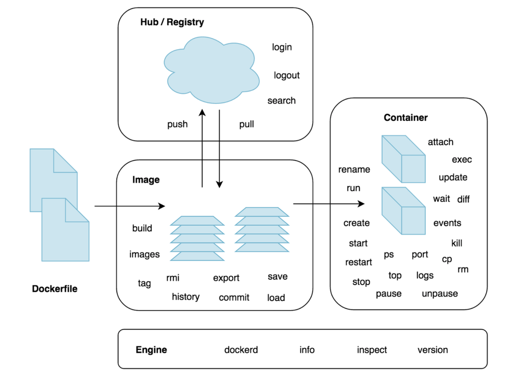

## Volume mounts

* Alternative to bind-mounts
* Volume survives removing containers using it
* These [can be shared](https://docs.docker.com/engine/tutorials/dockervolumes/#mount-a-shared-storage-volume-as-a-data-volume)
* Consider data corruption possibility when multiple containers write to a
  shared volume!

```sh
docker volume ls
docker volume create <name>

docker run -d <image>
docker run -d -v <name>:<mount point> <image> <command>
```

### Exercise 9 - Write output to volume

1. Create persistent volume named `pings`
1. Run `alpine` with `sh -c 'ping 8.8.8.8 > /data/ping.txt'` with `/data` being
   mounted to the `pings` volume
1. Run another `alpine` container that mounts `pings` and inspect `pings.txt`
   contents using `tail -f`

## Container networking

* 1 app per container -- how to proxy a node app behind nginx?
  * 1 nginx container
  * n app containers
* nginx needs access to the IPs/ports of the app containers
* Docker networks isolate apps from each other
* Each network gets its own DNS server
* Docker creates a default network (used unless specified otherwise), but you
  can create more and assign them using `--network`

### Exercise 10 - Container networking

1. Create a network named `hello`
1. Run two instances of `agross/hello` on the `hello` network, but `--name` them
   differently (`one` and `two`) and to not publish ports
1. Inspect `one` and `two`, look for network settings
1. Inspect the `hello` network
1. Step into either `one` or `two` and try to `ping` the other
1. Run nginx on the `hello` network

   ```sh
   docker run --rm -d --name nginx --network hello -p 80:80 nginx
   ```

1. Browse http://localhost to verify that nginx is working
1. Stop nginx
1. Write a nginx config file (`hello.conf`) that uses `one` and `two` as
   upstreams:

   ```conf
   upstream hello {
     server one:8080;
     server two:8080;
   }

   server {
     listen 80;
     location / {
       proxy_pass http://hello;
     }
   }
   ```

1. Restart nginx, this time with the conf above bind-mounted to
   `/etc/nginx/conf.d/default.conf`

   ```sh
   docker run -d --name nginx --network hello -p 80:80 -v $PWD/hello.conf:/etc/nginx/conf.d/default.conf nginx
   ```

1. Browse http://localhost again and refresh a few times

## Multi-container apps

* We use WordPress as an example
* WordPress requires MySQL or MariaDB (MySQL fork)

### Exercise 11 - Start WordPress

1. Download `wordpress` and `mariadb`
1. Create a new network for both apps
1. Run a MariaDB container on the network from step 2 and inject some
   environment variables:

   ```sh
   MARIADB_ROOT_PASSWORD=secret
   MARIADB_DATABASE=wordpress
   MARIADB_USER=wordpress
   MARIADB_PASSWORD=wordpress
   ```

   Is there a better way than multiple `--env` parameters? Hint: Use a file.
1. Run WordPress on the network from step 2 and tell it where it can find the
   database server:

   ```sh
   WORDPRESS_DB_HOST=<mariadb container name>:3306
   WORDPRESS_DB_USER=wordpress
   WORDPRESS_DB_PASSWORD=wordpress
   ```

1. Browse http://localhost and create a WordPress site. Did you forget to
   publish ports? ;-)
1. Restart the WordPress container to see if your installation was persisted
1. Congratulations, you just emulated `docker-compose`!

### `docker compose` use-cases

1. Development environments:
   * Running web apps in an isolated environment is crucial
   * The compose file allows to document service dependencies
   * Multi-page “developer getting started guides” can be avoided
1. Automated testing environments
   * Create & destroy isolated testing environments easily
   * Concurrent builds do not interfere
1. Production
   * All config items are in one place
   * Passwords are near-meaningless
   * Services do not interfere

### Features

1. `docker compose` creates a per-composition network by default, named after
   the current directory (unless `docker compose -p <name> ...` is specified).
1. When `docker compose up` runs it finds any containers from previous runs and
   reuses the *volumes* from the old container (i.e. data is restored).
1. When a service restarts and nothing has changed, `docker compose` reuses
   existing containers because it caches the configuration bits that were used to
   create a container.
1. Variables in the `docker-compose.yaml` file can be used to customize the
   composition for different environments.

   ```yaml
   web:
     ports:
       - "${EXTERNAL_PORT}:5000"
   ```

1. [Override settings for different environments](https://docs.docker.com/compose/extends/#example-use-case),
   e.g. `production.yml` containing changes specific for production:

   ```sh
   docker compose -f docker-compose.yml -f production.yml up -d
   ```

1. You can scale services with `docker-compose scale <service>=<instances>`

### Exercise 12 - WordPress using `docker compose`

Since WordPress cannot run without a database connection we need to ensure that
the database is ready to accept connections before WordPress starts. But Docker
does not really care about startup order and service readiness. There are
several solutions to this problem. Some involve using external tools like:

 * wait-for-it.sh [https://github.com/vishnubob/wait-for-it](https://github.com/vishnubob/wait-for-it) or
 * dockerize [https://github.com/jwilder/dockerize](https://github.com/jwilder/dockerize).

 Using these external tools require you to change a container's `ENTRYPOINT` or
 `CMD` (depending on how the image defines those). This change involves defining
 the dependency using the external tool and also telling the external tool what
 it means to start e.g. WordPress.

 Docker's builtin method, which is only available to `docker-compose.yaml` files
 using `version: 2` (e.g `2.x`), is to define a `HEALTHCHECK`-based dependency.
 Here the dependent container (database) must define healthiness and the
 depending container (WordPress) can then define its dependency to be satisfied
 if the dependent is healthy.

 ```yaml
 services:
  db:
    image: mysql

    # MySQL does not come with a HEALTHCHECK, so we need to define our own.
    healthcheck:
      # This check tests weather MySQL is ready to accept connections.
      test: ["CMD", "mysql", "--user", "root", "--password=secret", "--execute", "SELECT 1;"]
      # Allow 15 seconds for MySQL initialization before running the first check.
      start_period: 15s

  app:
    image: wordpress

    # Start the WordPress container after the database is healthy.
    depends_on:
      db:
        condition: service_healthy
 ```

You may use either method in the next exercise.

1. Create a directory `my-wordpress` and enter it
1. Create a new `docker-compose.yaml`
1. Paste the [following](examples/wordpress/docker-compose-healthiness.yaml):

   ```yaml
   services:
     mariadb:
       image: mariadb
       environment:
         MARIADB_ROOT_PASSWORD: secret
       volumes:
         - ./wp/db/conf:/etc/mysql/conf.d:ro
         - ./wp/db/data:/var/lib/mysql

       # Required because of "condition: service_healthy" below.
       healthcheck:
         test: ["CMD", "mariadb", "-uroot", "-psecret", "-e", "SELECT 1;"]
         start_period: 5s
         interval: 5s

     wordpress:
       image: wordpress:php7.0

       # Define "db" alias for the mariadb service.
       links:
         - mariadb:db

       environment:
         WORDPRESS_DB_HOST: db
         WORDPRESS_DB_PASSWORD: secret
       ports:
         - 80:80
       restart: always
       volumes:
         - ./wp/data:/var/www/html/wp-content

       # Define startup order.
       depends_on:
         mariadb:
           condition: service_healthy
         smtp:
           condition: service_started

     smtp:
       image: mwader/postfix-relay
       restart: always
       environment:
         POSTFIX_myhostname: example.com
   ```

1. Run `docker compose up`
1. Create a new WordPress site
1. Inspect running docker containers. What do you see?
1. Inspect docker networks. What do you see?

### Exercise 13 - Upgrade WordPress to use PHP 7.1

1. Have the composition from Exercise 11 running
1. Change `docker-compose.yaml` such that the `php7.1` tag is used for `wordpress`
1. Rebuild and restart the WordPress container:

   ```sh
   docker compose up --no-deps -d wordpress
   ```

### Exercise 14 - Maintain your environment

1. Scale `mariadb` to 2 instances
1. Step into `mariadb` using `docker compose exec`. In which instance did you
   step?
1. Restart the composition. How many `mariadb` instances are there?
1. Pause and unpause the application
1. Tear `down` the application and remove all containers, networks, etc.

### Exercise 15 - Debug your environment

1. Have a look at the `logs` for the composition and for a single service
1. Step into the WordPress container and kill all Apache processes
   with `kill $(pgrep -f apache)`. Is the container restarted? Why?
1. Retrieve the public port for WordPress

### Exercise 16 - Switch to volume

1. Stop the service from Exercise 11 (`docker compose stop`)
1. Add a new top-level section:

   ```yaml
   volumes:
     wp-db-conf:
     wp-db-data:
     wp-data:
   ```

1. [Change all `volumes:` to use volume mounts instead of bind mounts](examples/wordpress/docker-compose-healthiness-volumes.yaml).
   E.g. `- ./wp/mariadb/data:/var/lib/mysql` becomes `- wp-db-data:/var/lib/mysql`
1. Start the service again
1. Browse http://localhost. Is the WordPress site still available? Why? What
   should have been done in addition to changing the configuration?

### Exercise 17 - Locally build composition

1. Assume `agross/hello` needs a database
1. Can you think of a `docker-compose.yaml` file that builds a composition of
   `agross/hello`'s source
   code at [https://github.com/agross/docker-hello](https://github.com/agross/docker-hello)
   and e.g. MariaDB?

## Docker Swarm

* Built-in cluster
* There are alternatives like [Kubernetes](https://kubernetes.io/)
* Docker engines newer than 17.03 may create a new swarm:  `docker swarm init`
* Swarm members can be managers or workers (managers are workers too)
* 3-5 managers are recommended (more increases Raft communication and consensus finding)
* Use the [visualizer](https://github.com/dockersamples/docker-swarm-visualizer)
  on any manager node
* Services describe what you want to run, lead to tasks that will be distributed to workers
* This desired state is monitored and enforced
* Easy to scale apps: `docker service scale <name>=<tasks>`
* Show tasks with `docker service ps`
* Services can be updated, e.g. specify new arguments
* Rolling updates are supported
* Stacks abstract service definitions even further, comparable to `docker compose`

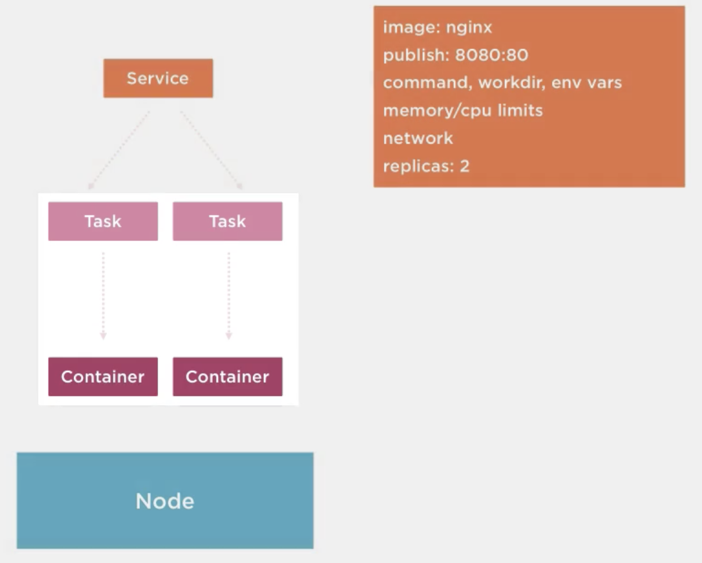

Commands shown:

```sh
docker swarm init --advertise-addr <IP address>
docker swarm join-token <manager|worker>
docker swarm join --token <token> <IP address>:<port>
docker node ls
docker swarm leave [--force]

docker run -it -d -p 8080:8080 -v /var/run/docker.sock:/var/run/docker.sock dockersamples/visualizer

docker-machine ls
docker-machine start
docker-machine stop

docker service create --name <name> -p <port> <image>
docker service scale <name>=<instances>
docker service ps <name>
docker service rm <name>
```

### Create swarm manager

```sh
docker swarm init --advertise-addr 192.168.99.100
```

### Join a swarm

On manager:

```sh
docker swarm join-token worker
docker info | grep -C 4 Swarm
docker node ls
```

On worker to-be:

```sh
docker swarm join <token> <address>
docker node ls (Try both on manager and worker)
```

Leave swarm:

```sh
docker swarm leave
```

### Drain a node and reactivate

```sh
docker service create --replicas 3 --name redis --update-delay 10s redis:3.0.6

docker node update --availability drain worker1

docker service ps redis

docker node update --availability active worker1
```

May cause service disruption if you force rebalancing tasks with

```sh
docker service update --force redis
```

### Rolling updates

```sh
docker service create \
  --replicas 3 \
  --name redis \
  --update-delay 10s \
  redis:3.0.6

docker service inspect --pretty redis

docker service update --image redis:3.0.7 redis

docker service ps redis
```

### Service configs

```sh
echo "This is a config" | docker config create my-config -

docker config ls

docker service create --name redis --config my-config redis:alpine
```

Map config location:

```sh
docker service create --config src=homepage,target="/some/path/index.html" ...

docker exec $(docker ps --filter name=redis -q) ls -l /my-config

docker config rm my-config

docker service update --config-rm my-config redis

docker exec -it $(docker ps --filter name=redis -q) cat /my-config
```

Rotate config:

```sh
docker service update \
  --config-rm site.conf \
  --config-add source=site-v2.conf,target=/etc/nginx/conf.d/site.conf \
  nginx
```

### Secrets

> When you add a secret to the swarm, Docker sends the secret to the swarm
> manager over a mutual TLS connection. The secret is stored in the Raft log,
> which is encrypted. The entire Raft log is replicated across the other
> managers.
>
> When you grant a newly-created or running service access to a secret,
> the decrypted secret is mounted into the container in an in-memory filesystem.
> The location of the mount point within the container defaults to
> `/run/secrets/<secret_name>`.

Since docker 1.13 secrets are encrypted.

```sh
docker secret create
docker secret inspect
docker secret ls
docker secret rm

docker service create --secret ...
docker service update --secret-add and --secret-rm
```
